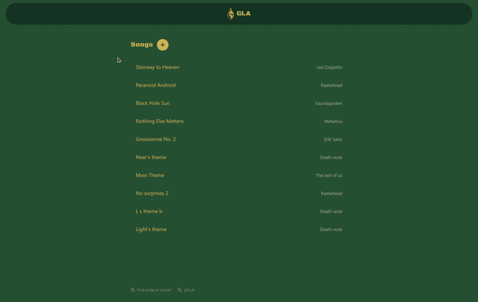
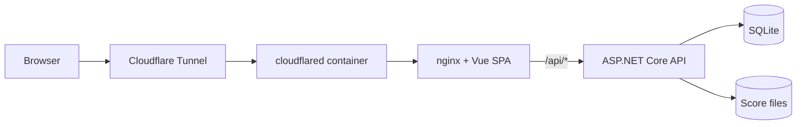

# GLA - Guitar Learning App

Learning guitar songs should be fun and structured. Upload a tab/score file, play it back, solo or mute individual tracks and practice along. Difficulty analysis and a recommended learning order are the next phase.

**Live demo: [gla.orbitalgarden.net](https://gla.orbitalgarden.net/)** - self-hosted on an Orange Pi Zero 3 (ARM64) behind a Cloudflare Tunnel.

<p align="center">
  
</p>

## The problem

Learning a song from YouTube tab videos usually goes the same way: the video isn't quite the right arrangement, the tab is bad, the song turns out harder than expected, and there is no sense of progress or structure, so people slow down or quit.

**Who it's for:** hobby guitarists who learn songs from Guitar Pro-style tabs.
**Outcome:** a place where a tab becomes something interactive you can play, loop and break down, with structure and progress tracking built on top (post-MVP).

The full product vision is in [`docs/GLA.md`](docs/GLA.md).

## What works today (MVP)

- Songs list page with add-song (upload) and delete-song
- Interactive score rendering and playback (alphaTab) for Guitar Pro files
- Track controls: mute, volume, solo, render selected track
- Responsive layout with a separate mobile UX (auto-hiding header/footer, swipe-up track controls)
- Production deployment: Docker Compose, Cloudflare Tunnel, ARM64 images

## Roadmap

Not built yet, in rough order:

1. Split songs into fragments
2. Difficulty per fragment and overall, plus detected techniques
3. Recommended learning order and a focused "practice this fragment" mode
4. Mark fragments as learned, progress tracking
5. Authentication (not needed for the MVP)

Longer term: find tabs by song name, playlist analysis, attempt evaluation through audio input, community notes.

## Architecture



- The browser only talks to nginx: static SPA assets, and `/api/*` proxied to the backend, so the app is same-origin and no CORS is involved in production.
- The score file is streamed by the API and rendered client-side by alphaTab.
- There are no open inbound ports on the host: the tunnel connects outward.

## Stack

| Layer    | Technology |
| -------- | ---------- |
| Backend  | ASP.NET Core (.NET 10), EF Core, SQLite, System.Text.Json |
| Frontend | Vue 3, Vite, TypeScript, Tailwind CSS 4, Vue Router, Pinia, alphaTab |
| Tests    | xUnit (backend, SQLite in-memory) |
| Deploy   | Docker Compose (backend, frontend/nginx, cloudflared), Cloudflare Tunnel, ARM64 |

Details in [`docs/STACK.md`](docs/STACK.md).

## Built with AI assistance

The project was built with [opencode](https://opencode.ai) AI coding tool. Scope, product decisions and architecture are mine; opencode did a large share of the implementation. For example, page skeletons were partially hand-written first and then improved with opencode's version.

## Feedback and iteration

Shared with 3 testers after deployment. The feedback so far:
- "Delete song" button can be pressed by accident on a smartphone. **FIXED: added deletion confirmation dialog**
- Some songs do not have artists, but the creation form requires one. **FIXED: make song title & author optional**

## Quick start (Docker)

The production stack is `backend` (ASP.NET Core), `frontend` (nginx serving the built SPA) and `cloudflared`. Images are pinned to `linux/arm64` (the deployment target). Next to each one there is a commented `platform: linux/amd64` line to flip to for testing on x86 hosts.

```bash
# 1. Configure secrets/settings - .env is gitignored, .env.example is the template
cp .env.example .env
#    → set CF_TUNNEL_TOKEN, WEB_PORT, …

# 2. Build and start everything
docker compose up -d --build

# 3. Smoke test through nginx
curl http://localhost/api/songs    # nginx → backend → SQLite
open http://localhost/             # the SPA (deep links like /songs/1 included)
```

- **nginx** serves `frontend/dist` with SPA fallback (`/songs/1` loads `index.html`) and proxies `/api/*` to the backend with the prefix stripped, the same contract as the Vite dev proxy.
- **cloudflared** runs `tunnel --no-autoupdate run --token $CF_TUNNEL_TOKEN`; point the tunnel's public hostname at `http://frontend:80` in the Cloudflare dashboard (Zero Trust → Tunnels).
- **Database**: a single SQLite file in the `gla-data` Docker volume (`/data/gla.db`). On startup the backend applies pending EF migrations; the seed songs are part of the migrations, so a fresh database starts populated. There is no database service to run or patch.
- **Score files** live in `./storage`, bind-mounted into the backend container.

## Local development

Prerequisites: .NET SDK 10, Node.js 20+ (tested on 24), Docker (for the production stack only).

```bash
# 1. Backend - creates the SQLite database, migrates and seeds it on startup
cd backend
dotnet run
# → http://localhost:5233

# 2. Frontend - in a second terminal
cd frontend
npm install
npm run dev
# → http://localhost:5173  (opens on the songs list)
```

Application data lives in `storage/` at the repo root (gitignored): score files you drop in yourself (the seeded *Stairway to Heaven* expects `storage/led-zeppelin-stairway_to_heaven.gp4`) and the development database `storage/gla.db`.

### Scripts

```bash
dotnet test GLA.slnx      # backend unit tests
npm run build             # frontend type-check + production build (frontend/)
npm run type-check        # frontend type-check only (frontend/)
```

### Testing from another device on your LAN

Both dev servers bind to all interfaces, so you can open the app from any device on your LAN using your laptop's IP instead of `localhost` (e.g. `http://192.168.1.23:5173`). The Vite dev server proxies `/api/*` to the backend, so no CORS setup is needed, except if a client hits `http://<lan-ip>:5233` directly; then its origin must be added to `Cors:AllowedOrigins` in `backend/appsettings.Development.json`. If other devices cannot connect at all, allow `node` and `dotnet` through the Windows firewall for private networks.

## API

| Method | Route              | Description                                   |
| ------ | ------------------ | --------------------------------------------- |
| GET    | `/songs`           | All songs                                     |
| GET    | `/songs/{id}`      | One song, `404` if missing                    |
| GET    | `/songs/{id}/file` | Score file bytes, `404` if missing            |
| POST   | `/songs`           | Upload a score file (multipart: one file, optional title/author) |
| DELETE | `/songs/{id}`      | Delete the song, then its file (best effort)  |

Response:

```json
{ "id": 1, "title": "Stairway to Heaven", "author": "Led Zeppelin", "filePath": "led-zeppelin-stairway_to_heaven.gp4" }
```

`filePath` is relative to `storage/` (forward slashes, no leading slash); the file endpoint streams it to the client, where alphaTab renders it in the score viewport.

## Project layout

```
├── backend/             ASP.NET Core backend
│   ├── Data/            DbContext + migrations
│   ├── Dtos/            API contracts
│   ├── Endpoints/       Route mappings
│   ├── Entities/        EF entities
│   ├── Repositories/    Data access
│   └── Services/        Application logic
├── GLA.Tests/           xUnit tests (SQLite in-memory)
├── frontend/            Vue 3 frontend (Vite + Tailwind)
│   ├── nginx.conf       Production static server + /api proxy
│   └── src/
│       ├── components/  ScoreViewport, PlayerControls, SongUploadDialog
│       ├── services/    songApi
│       ├── stores/      Pinia song store
│       ├── types/       API models
│       └── views/       SongsView, SongView
├── docs/                Product & feature specs
├── storage/             Score files + dev database (gitignored)
├── .env.example         Deployment settings template (copy to .env)
└── docker-compose.yml   Production stack (backend/frontend/cloudflared)
```

## Development notes

- **Migrations**: `dotnet tool restore`, then `dotnet ef migrations add <Name> --project backend --startup-project backend --output-dir Data/Migrations` (SQLite is the single provider; migrations were regenerated for it)
- **Seed data**: 5 songs are seeded through `HasData` in `GlaDbContext` (ids 1–5), written by the initial migration
- **Connection string**: `backend/appsettings.Development.json` = `Data Source=../storage/gla.db`. Relative paths are resolved against the content root (`backend/`), not the working directory; the container gets the absolute `Data Source=/data/gla.db` from `docker-compose.yml`
- **alphaTab assets**: Bravura fonts and the SONiVOX soundfont are copied from `node_modules` into `frontend/public/` by a Vite plugin on dev/build (gitignored). On a *fresh clone* the dev server can start before `frontend/public/` exists, and alphaTab then logs font/soundfont loading errors because the assets come back as `index.html`. Restart `npm run dev` once the directory exists (or run `npm run build` first).
- **Phases**: see [`docs/PHASES.md`](docs/PHASES.md)

## Where to get scores

The app footer links to a [site](https://gprotab.net/) where Guitar Pro files can be downloaded. Supported upload formats: Guitar Pro files (`.gp4` and other formats alphaTab can load).
